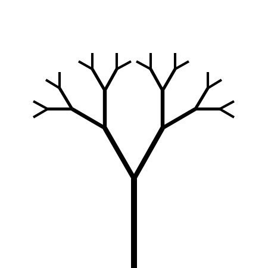
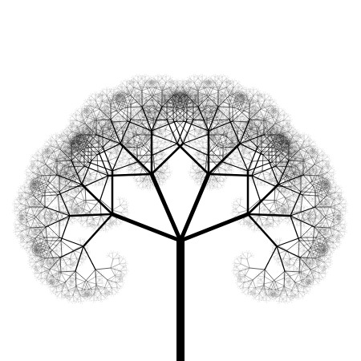

# Fractal Tree Project
Project to create a fractal tree with configurable parameters.

## How to use
To use this project, simply download the repo and open up the index.html in any browser of your choice.

## Examples
Here are some examples of the project running with various settings

## Future Goals
Goals for the project in no particular order

- Add more save types (bmp, gif, svg)
- Animate rendering
  - Animate rendering with configurable delay in ms between branches
  - Change rendering order: DFS, BFS, Random (currently using BFS)
- Random range adjustable values
  - Adjustable ranges for various rendering tree parameters
  - Change distribution types: Uniform, Normal, etc...
- Selectable background color
- Colors in branches
  - Add variable and configurable color schemes (gradient, ordered, random, solid)
- Different types of draw in tree (solid, outline, rounded, 'hand-drawn')
- Add testing and style enforcement to javascript files

